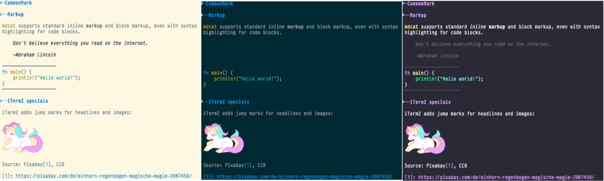

# mdcat

[][crates]

[][travis]

`cat` for [CommonMark][]: Show CommonMark (a standardized Markdown dialect)
documents on text terminals.

```
$ mdcat sample.md
```



mdcat in [iTerm2][], with [Dracula][], and [Solarized][] Light and Dark (from
left to right), and [PragmataPro][pp] as font.

[crates-badge]: https://img.shields.io/crates/v/mdcat.svg
[crates]: https://crates.io/crates/mdcat
[travis]: https://travis-ci.org/lunaryorn/mdcat
[CommonMark]: http://commonmark.org
[Solarized]: http://ethanschoonover.com/solarized
[dracula]: https://draculatheme.com/iterm/
[iterm2]: https://www.iterm2.com
[pp]: https://www.fsd.it/shop/fonts/pragmatapro/

## Features

`mdcat` works best with [iTerm2][] or a compatible terminal emulator, and a
good terminal font which includes italic characters.  It supports:

* All CommonMark syntax
* Syntax highlighting for code blocks
* In [iTerm2][] and VTE-based terminals: Inline links, with dashed underline like in the screenshot above
* In [iTerm2][]: Inline images like in the screenshot above
* In [iTerm2][]: Jump marks for headings (jump forwards and backwards with
  <key>⇧⌘↓</key> and <key>⇧⌘↑</key>)

Not supported:

* CommonMark extensions: Footnotes and Tables
* Images from remote URLs
* SVG images
* Re-filling paragraphs

## Installation

Install [Rust][rustup] and run `cargo install mdcat`.  To keep mdcat up to date
install [cargo-update][] and run `cargo install-update mdcat`.

### 3rd party packages

* Arch Linux: [mdcat in AUR][aur]

[rustup]: https://www.rustup.rs
[cargo-update]: https://github.com/nabijaczleweli/cargo-update
[aur]: https://aur.archlinux.org/packages/mdcat/

### Future plans

- [ ] Fetch remote images to show them inline.
- [ ] Render SVG images.
- [ ] Figure out a better way to show HTML [GH-3](https://github.com/lunaryorn/mdcat/issues/3).
- [ ] CommonMark extensions: Footnotes [GH-1](https://github.com/lunaryorn/mdcat/issues/1).
- [ ] CommonMark extensions: Tables [GH-2](https://github.com/lunaryorn/mdcat/issues/2).
- [ ] Ignore soft wraps and wrap inline text a column limit instead [GH-4](https://github.com/lunaryorn/mdcat/issues/4).

## License

Copyright 2018 Sebastian Wiesner <sebastian@swsnr.de>

Licensed under the Apache License, Version 2.0 (the "License"); you may not use
this file except in compliance with the License. You may obtain a copy of the
License at <http://www.apache.org/licenses/LICENSE-2.0>.

Unless required by applicable law or agreed to in writing, software distributed
under the License is distributed on an "AS IS" BASIS, WITHOUT WARRANTIES OR
CONDITIONS OF ANY KIND, either express or implied. See the License for the
specific language governing permissions and limitations under the License.
